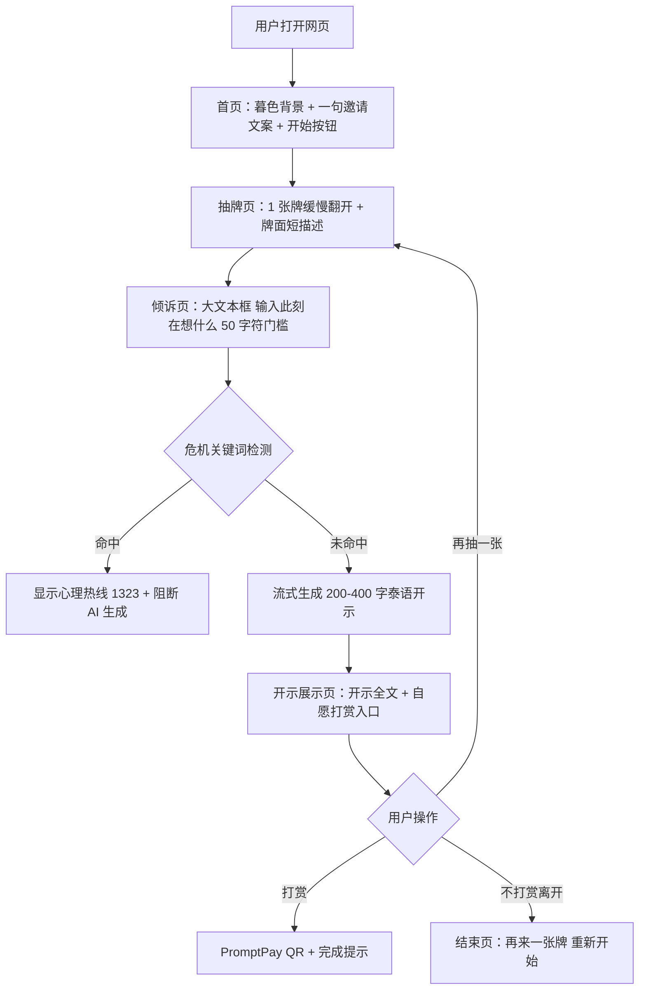

# 1. 项目概述

> 本文件是 PRD/ 文件夹的第 1 部分。如需了解产品全貌请先读 [README.md](./README.md)。
> 上一模块：— · 下一模块：[02-tech-stack.md](./02-tech-stack.md)

---

## 1.1 产品名称

**โอบ** （泰语 "拥抱"，工作代号 `Hug`，正式品牌待 design-spec 阶段确认）

## 1.2 一句话描述

一个让泰国扛家中年女性在凌晨三点也能打开手机、抽一张牌、收到一段有重量的泰语开示、被接住情绪、自愿打赏的私密 Web 网页。

## 1.3 核心价值主张

- **用户痛点**：没有任何私密、不评判、24h 可触达的倾诉对象——TikTok 评论区是公开的不敢说真话，家人是索取方，朋友会评价，专业心理咨询有文化阻力（数据中 0 提及）。来源：[BRD.md](../BRD.md) · [MRD.md](../MRD.md) §1
- **我们的解法**：用占卜壳子降低使用门槛（看牌在泰国是日常行为），让用户匿名写下此刻处境，AI 生成 200-400 字泰语长开示（不是"加油"两个字），看完觉得被接住可自愿打赏 20-50 泰铢
- **差异化**：所有现有占卜产品押"算得准不准"，我们押"被接住"。这是 MRD 反直觉发现的直接产品化（数据中"求被算"0 条 vs "求倾诉"593+ 条）

## 1.4 目标用户

- **主要用户**：泰国中年女性（30-55 岁）为主，自我标签「เดอะแบก」(扛家者)；含单亲母亲、家中长女、家庭经济支柱；夹杂少量同样身份的中年男性
- **使用场景**：
  - 凌晨独自崩溃想找出口
  - 家人/伴侣只问转账不问情绪后的瞬间
  - 重病/重压下需要一个不评判的精神角落
  - 主动从糟糕关系里退出后独自硬撑

来源：[MRD.md](../MRD.md) §2 / [BRD.md](../BRD.md) §2

## 1.5 MVP 范围声明

### ✅ V1 做（3 个核心功能）

1. **匿名倾诉容器**：无需注册，用浏览器匿名 session 完整说出此刻处境（多行泰语文本 + 至少 50 字符门槛保证表达深度）
2. **抽牌 + AI 长开示**：随机抽 1 张塔罗牌作为入口仪式 → 调用 Claude Sonnet 4.6 流式生成 200-400 字泰语开示（针对用户具体处境，不套通用安慰话术）
3. **自愿打赏闭环**：开示生成完毕后展示"如果觉得被接住"提示 + 三档打赏（20 / 35 / 50 泰铢，PromptPay QR）；不强制、不弹窗、不打断

> 危机干预兜底（识别极端关键词 → 推送泰国心理热线 1323 + 阻断 AI 生成）作为**安全护栏**写在每个功能里，**不占核心功能配额，但是 V1 上线硬门槛**（继承 BRD `hard_gates_before_launch`）。详见 [07-business-logic.md](./07-business-logic.md) §7.4

### ❌ V1 不做

| 不做 | 原因 |
|------|------|
| 用户注册 / 登录 / 账号系统 | 匿名是 P0 价值的根基——一旦要注册就违背"不暴露身份"承诺 |
| 历史记录 / 收藏 / 我的开示 | 与匿名 session 冲突；倾诉的私密性要求"说完就走" |
| 月订阅 / 会员 | BRD 商业模式明确押单次打赏，不押订阅 |
| 真人算命师入驻 / 真人私聊 | V2 探索方向，MVP 先验证 AI 内容能否成立 |
| 群体共鸣社区 / 帖子流 / 评论 | MRD P1 功能，V2 验证留存后再做 |
| 多种牌阵（凯尔特十字等）| V1 只用单张牌简化仪式，复杂牌阵 V2 |
| 多语言切换（中/英）| V1 仅泰语，目标市场是泰国 |
| 原生 App | Web 响应式优先，App 是 V3 之后的事 |
| 凌晨时段特殊 UI（深夜模式自动切换）| V1 用统一夜色调性即可，自动切换 V2 |
| 通知 / 推送 / 邮件 | 与匿名 session 冲突 |

来源：[BRD.md](../BRD.md) §3 + 上游对话

## 1.6 核心用户流程

**最短闭环 ≤ 5 步**：打开 → 抽牌 → 倾诉 → 看开示 → 打赏(可选)。一次完整体验 3-5 分钟。
