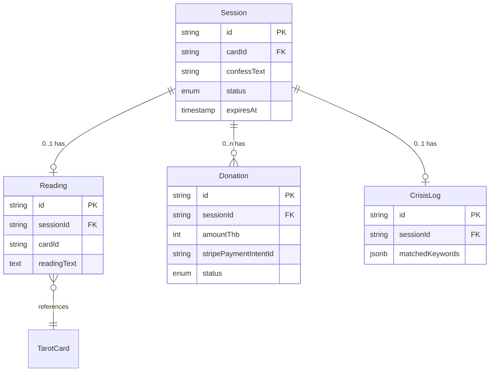

# 6. 数据模型

> 本文件是 PRD/ 文件夹的第 6 部分。如需了解产品全貌请先读 [README.md](./README.md)。
> 上一模块：[05-ai-capabilities.md](./05-ai-capabilities.md) · 下一模块：[07-business-logic.md](./07-business-logic.md)

---

## 6.1 数据实体

### TarotCard（静态资源，不入库）

```typescript
interface TarotCard {
  id: string;                  // 'major-00-fool' 这类 slug
  nameTh: string;              // 泰语牌名
  nameEn: string;              // 英文牌名（运维参考）
  arcana: 'major' | 'minor';   // 大牌 / 小牌
  keywordsTh: string[];        // 泰语关键词，喂给 prompt
  imageUrl: string;            // 牌面图 URL（CDN 或本地 public/）
}
```

> V1 采用静态 JSON：`src/lib/tarot-deck.ts`，22 张大阿尔卡那为主，避免 78 张全套带来的设计成本。56 张小阿尔卡那 V2 引入。

### Session（匿名会话）

```typescript
interface Session {
  id: string;                  // nanoid(16)，URL 安全
  cardId: string | null;       // 抽到的牌 id（null = 还未抽）
  confessText: string | null;  // 倾诉原文（null = 还未倾诉）
  status: SessionStatus;       // 见下方枚举
  createdAt: Date;
  updatedAt: Date;
  expiresAt: Date;             // 创建后 7 天硬过期，自动删除
  // 注意：不存任何用户身份字段——无 IP、无 UA、无邮箱
}

type SessionStatus =
  | 'created'        // 初始
  | 'card_drawn'     // 已抽牌
  | 'confessed'      // 已倾诉
  | 'crisis'         // 命中危机干预
  | 'reading_done'   // 开示生成完毕
  | 'expired';       // 已过期
```

### Reading（开示记录）

```typescript
interface Reading {
  id: string;                  // nanoid(16)
  sessionId: string;           // 外键 → Session.id
  cardId: string;              // 冗余存储（避免 join 时 Session 过期已删）
  // confessText: 不在 Reading 表保存——见 §6.5 隐私策略
  readingText: string;         // 完整开示泰语正文
  modelVersion: string;        // 'claude-sonnet-4-6' 等
  promptVersion: string;       // 'v1.0.0' 用于 prompt 版本回溯
  generatedAt: Date;
}
```

### Donation（打赏记录）

```typescript
interface Donation {
  id: string;                  // nanoid(16)
  sessionId: string;           // 外键 → Session.id
  amountThb: number;           // 泰铢，正整数（20 / 35 / 50）
  stripePaymentIntentId: string;
  status: DonationStatus;
  createdAt: Date;
  paidAt: Date | null;         // webhook 收到 payment_intent.succeeded 时填
}

type DonationStatus =
  | 'pending'        // 创建 PaymentIntent
  | 'awaiting_payment'  // QR 已展示，等用户银行 App 扫码
  | 'succeeded'      // webhook 确认
  | 'failed'
  | 'expired';       // QR 过期
```

### CrisisLog（仅服务端日志，用于运营复盘）

```typescript
interface CrisisLog {
  id: string;
  sessionId: string;
  matchedKeywords: string[];   // 命中的关键词（泰语原文）
  // 注意：不存 confessText 原文——见 §6.5
  createdAt: Date;
}
```

## 6.2 实体关系（ER 图）



## 6.3 Supabase Schema（PostgreSQL）

```sql
-- sessions
CREATE TABLE sessions (
  id          TEXT PRIMARY KEY,
  card_id     TEXT,
  confess_text TEXT,
  status      TEXT NOT NULL DEFAULT 'created',
  created_at  TIMESTAMPTZ NOT NULL DEFAULT NOW(),
  updated_at  TIMESTAMPTZ NOT NULL DEFAULT NOW(),
  expires_at  TIMESTAMPTZ NOT NULL DEFAULT (NOW() + INTERVAL '7 days')
);
CREATE INDEX idx_sessions_expires_at ON sessions(expires_at);

-- readings
CREATE TABLE readings (
  id              TEXT PRIMARY KEY,
  session_id      TEXT NOT NULL REFERENCES sessions(id) ON DELETE CASCADE,
  card_id         TEXT NOT NULL,
  reading_text    TEXT NOT NULL,
  model_version   TEXT NOT NULL,
  prompt_version  TEXT NOT NULL,
  generated_at    TIMESTAMPTZ NOT NULL DEFAULT NOW()
);
CREATE INDEX idx_readings_session_id ON readings(session_id);

-- donations
CREATE TABLE donations (
  id                          TEXT PRIMARY KEY,
  session_id                  TEXT NOT NULL REFERENCES sessions(id) ON DELETE CASCADE,
  amount_thb                  INTEGER NOT NULL CHECK (amount_thb > 0),
  stripe_payment_intent_id    TEXT NOT NULL UNIQUE,
  status                      TEXT NOT NULL DEFAULT 'pending',
  created_at                  TIMESTAMPTZ NOT NULL DEFAULT NOW(),
  paid_at                     TIMESTAMPTZ
);
CREATE INDEX idx_donations_session_id ON donations(session_id);
CREATE INDEX idx_donations_stripe_pi ON donations(stripe_payment_intent_id);

-- crisis_logs
CREATE TABLE crisis_logs (
  id                  TEXT PRIMARY KEY,
  session_id          TEXT NOT NULL REFERENCES sessions(id) ON DELETE CASCADE,
  matched_keywords    JSONB NOT NULL,
  created_at          TIMESTAMPTZ NOT NULL DEFAULT NOW()
);

-- Row-Level Security：默认禁止所有匿名读写，仅服务端 service_role 可写
ALTER TABLE sessions ENABLE ROW LEVEL SECURITY;
ALTER TABLE readings ENABLE ROW LEVEL SECURITY;
ALTER TABLE donations ENABLE ROW LEVEL SECURITY;
ALTER TABLE crisis_logs ENABLE ROW LEVEL SECURITY;
-- （所有表无 SELECT/INSERT 给 anon，仅服务端 API 路由用 service_role 操作）
```

## 6.4 客户端存储（cookie）

| Key | 数据类型 | 用途 | 过期策略 |
|-----|---------|------|---------|
| `hug_session` | string (nanoid) | 当前匿名 session id；HttpOnly + Secure cookie | 24 小时；用户关掉浏览器一段时间会重新生成 |

> **不使用 localStorage**——避免任何客户端持久化倾诉文本；session 完全由服务端 cookie 控制。

## 6.5 数据流向 + 隐私策略

```mermaid
flowchart LR
    A[用户输入倾诉] --> B[/api/reading 接收]
    B --> C{危机关键词检测}
    C -->|命中| D[写入 crisis_logs<br/>仅关键词，不存原文]
    C -->|未命中| E[Moderation API]
    E --> F[Anthropic streamText]
    F --> G[流式返回前端]
    G --> H[流结束 → 写入 readings<br/>仅存开示文本，不存倾诉原文]
    H --> I[Session.confessText<br/>24h 后置 NULL]
```

**隐私硬性规则**：
1. `sessions.confess_text` 在 24 小时后被定时任务（Supabase Edge Function cron）置 NULL，仅保留状态字段用于运营统计
2. `readings.reading_text` **不删除**（开示是 AI 输出，不属于个人隐私），保留供 prompt 调优分析
3. `crisis_logs` **不存倾诉原文**，仅记录命中的关键词
4. 任何表都**不记录**：IP、UserAgent、用户名、邮箱、设备指纹
5. 7 天硬过期：`sessions.expires_at` 到达后由 cron 删除整行，级联删除所有关联记录

> 本节支撑 [03-design-handoff.md](./03-design-handoff.md) §3.5 的"安全感、不被评判、被接住"核心承诺
