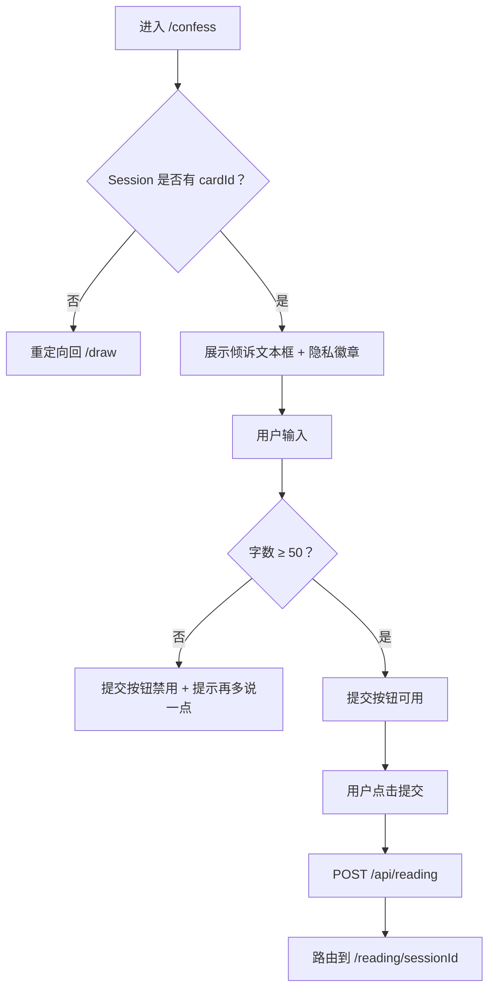
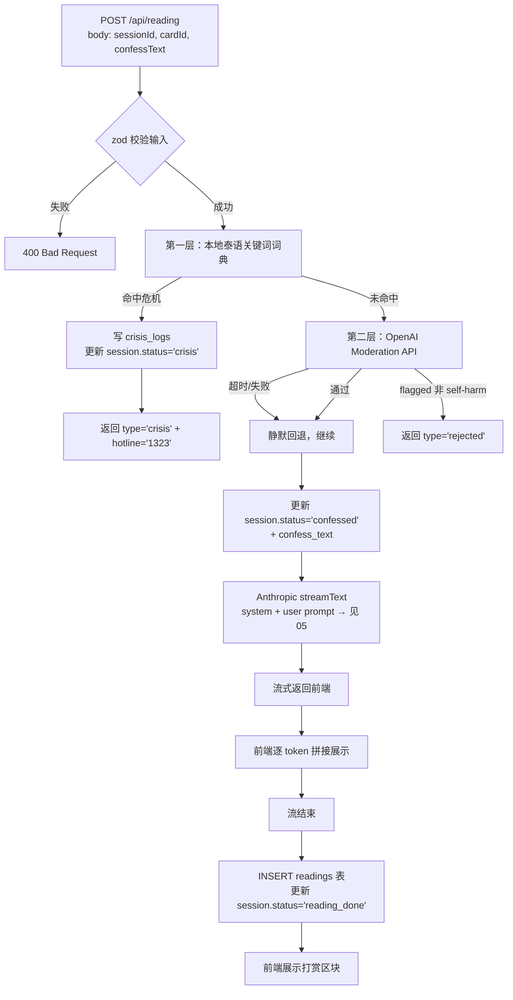
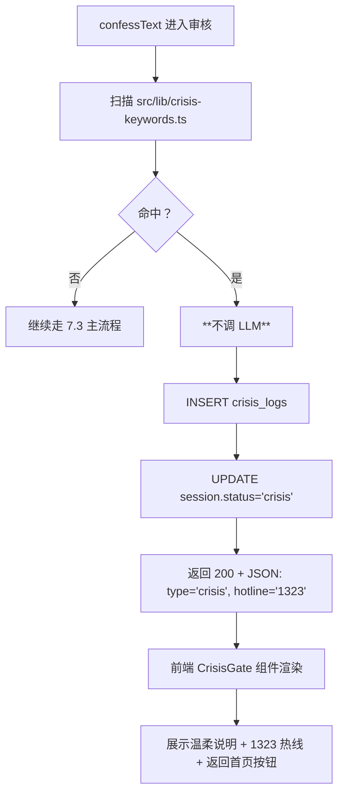

# 7. 核心业务逻辑

> 本文件是 PRD/ 文件夹的第 7 部分。如需了解产品全貌请先读 [README.md](./README.md)。
> 上一模块：[06-data-model.md](./06-data-model.md) · 下一模块：[08-state-management.md](./08-state-management.md)

---

V1 共 4 个核心业务流：抽牌 → 倾诉 → 生成开示 → 打赏。再加 1 个安全护栏（危机干预）。

每个功能的**验收标准**和**不做清单**都在节末。

---

## 7.1 抽牌

### 触发条件

用户在首页点击"开始"按钮，跳转 `/draw`。

### 处理流程

```mermaid
flowchart TD
    A[进入 /draw] --> B{Session cookie 是否存在？}
    B -->|否| C[创建新 Session<br/>nanoid + 写 cookie + INSERT sessions]
    B -->|是| D[复用现有 Session]
    C --> E[展示牌堆]
    D --> E
    E --> F[用户点击牌堆]
    F --> G[随机抽 1 张牌<br/>22 张大阿尔卡那等概率]
    G --> H[播放翻牌动画 ~1.2s]
    H --> I[更新 Session.cardId + status='card_drawn']
    I --> J[展示牌面 + 牌名 + 短描述]
    J --> K[出现"继续"按钮 → 跳 /confess]
```

### 业务规则

- 等概率随机：`Math.random()` 即可，V1 不做"伪随机算命师式"加权
- 同一 session 重新抽牌：允许（清空 `cardId` 重新抽，覆盖前一次）
- 翻牌动画期间禁用"继续"按钮
- 牌面图加载失败：用占位牌名文本卡片代替（→ [09-error-handling.md](./09-error-handling.md) §9.4）

### 验收标准

- [ ] 用户从首页点击"开始" 1 秒内进入抽牌页
- [ ] 点击牌堆后 1.2 秒内看到牌面翻开
- [ ] 同一用户连续抽 10 次，至少出现 5 张不同的牌（验证随机性）
- [ ] 强制 throttle 网络（slow 3G）下牌面图能 fallback 到文本卡片
- [ ] 浏览器后退按钮回到首页，前进再进入 `/draw` 状态正确（牌还在）

### 不做（V1）

- ❌ 多张牌阵（凯尔特十字、三牌过去现在未来等）
- ❌ 牌面长描述 / 牌的"正位逆位"
- ❌ 用户选牌（从扇形展开的牌堆点选某一张）
- ❌ 抽牌历史记录

---

## 7.2 倾诉输入

### 触发条件

用户在 `/draw` 抽完牌后点击"继续"，跳转 `/confess`。

### 处理流程



### 业务规则

- **字数下限 50** 个字符——保证表达深度，避免一句"我累了"就触发 AI（成本浪费 + 开示质量低）
- **字数上限 1000** 个字符——避免恶意刷长 prompt 烧钱
- 提交后立刻路由跳转，不等 API 响应（流式生成在 `/reading/[sessionId]` 内进行）
- 失焦自动保存草稿到 `sessionStore`（前端 zustand），刷新页面不丢

### 边界情况

| 场景 | 系统行为 | 用户感知 |
|------|---------|---------|
| 用户直接访问 `/confess` 没抽过牌 | 重定向 `/draw` | 看到抽牌页 |
| 输入纯空格/换行符 | 视为字数 0 | 提交按钮禁用 |
| 输入超过 1000 字 | 阻止继续输入 | 字数提示变红色提示已达上限 |
| 网络断开点击提交 | 失败提示 | "网络似乎断了，再试一次？"（→ [09-error-handling.md](./09-error-handling.md) §9.1） |

### 验收标准

- [ ] 字数 < 50 时提交按钮明确禁用，且字数实时更新
- [ ] 输入泰语字符正确计数（不能把每个泰语字符按多字节算成多个字）
- [ ] 失焦再回到页面，已输入的内容还在
- [ ] 1000 字硬上限不能突破

### 不做（V1）

- ❌ 富文本 / 表情符号选择器
- ❌ 语音输入
- ❌ 多语言输入切换
- ❌ AI 实时建议"你是不是想说..."

---

## 7.3 生成长开示（核心 AI 调用）

### 触发条件

用户在 `/confess` 点击提交。

### 处理流程



### 业务规则

- **双层审核**：本地泰语词典优先（响应 < 50ms，文化适配），Moderation API 兜底
- 危机干预命中时**不调 LLM**——直接返回 1323 热线信息，节省成本 + 防误导
- LLM 输出过短（< 200 字符）：记录日志但仍展示给用户（避免反复重试燃烧成本）
- LLM 输出过长（> 500 字符）：流式期间不主动截断，结束后写库时全部保存
- Prompt 版本通过 `promptVersion` 字段记录（默认 `v1.0.0`），便于 A/B 调优

### 输入输出

- **输入**：`{ sessionId, cardId, confessText }`（POST JSON）
- **输出**：`text/event-stream` 流式返回；流结束后副作用为 INSERT readings + UPDATE sessions
- **副作用**：可能触发 `crisis_logs` INSERT、`sessions` UPDATE

### 边界情况

| 场景 | 系统行为 | 用户感知 |
|------|---------|---------|
| 同一 session 已有 reading_done 状态又调用 | 允许（覆盖式生成新 reading） | 看到新的开示 |
| LLM 流到一半网络中断 | 已生成部分保留前端展示 | "似乎信号断了一下" + 重试按钮 |
| LLM 60s 超时未给出首 token | 中断 + 提示 | "今晚的回应来得慢了一点" |
| LLM 返回非泰语内容 | V1 不强制重试（监控告警，运营复盘） | 用户看到非泰语内容（罕见） |

### 验收标准

- [ ] 首 token 到达时间 P95 < 5s
- [ ] 完整开示生成 P95 < 30s
- [ ] 流式过程中前端可见到逐字打字效果
- [ ] 流结束后开示文本完整写入 readings 表
- [ ] 生成期间用户尝试关闭页面会有"开示生成中"提示

### 不做（V1）

- ❌ 多模型对比生成
- ❌ 用户对开示打分 / 反馈
- ❌ 重新生成（V1 同一 session 的开示生成 = 一次性）
- ❌ 开示分享到社交平台
- ❌ 开示语音播放

---

## 7.4 危机干预（安全护栏，非独立功能）

### 触发条件

`/api/reading` 收到请求时，本地泰语词典命中"想消失/自伤/自杀"等极端关键词。

### 处理流程



### 关键词词典（V1 起步版本）

`src/lib/crisis-keywords.ts` 至少包含以下 8 个泰语关键词及其变体（**最终版本由签约的泰国本地内容顾问审核扩充**，BRD `hard_gates_before_launch` 强制项）：

```typescript
// 起步版本（必须由本地顾问审核扩充）
export const CRISIS_KEYWORDS_TH: string[] = [
  'อยากตาย',          // 想死
  'ฆ่าตัวตาย',         // 自杀
  'ไม่อยากอยู่',        // 不想活了
  'อยากหายไป',         // 想消失
  'จบชีวิต',           // 结束生命
  'กรีดข้อมือ',         // 割腕
  'หมดหวัง',           // 绝望（强语境时命中）
  'ไม่มีใครรัก',         // 没有人爱（强语境时命中）
];
```

### 业务规则

- **命中即阻断 LLM**——任何情况下不让 AI 给"想死的人"输出"开示"
- 阻断响应必须是**温柔的、不冰冷、不像错误页**——不是"你的输入违规"，而是"我听到你在说很重的事，先和真人聊聊好吗？"
- 必须展示泰国心理热线 **1323**（24 小时免费）
- 命中关键词的会话**不计入**有效"被接住"成功率统计（业务指标隔离）

### 验收标准（BRD 上线硬门槛）

- [ ] 关键词词典经泰国本地内容顾问审核扩充至 ≥ 30 个核心词及变体
- [ ] 命中关键词的请求**绝对不调 LLM**（用 mock 测试覆盖）
- [ ] 1323 热线信息可点击直拨（`tel:1323`）
- [ ] CrisisGate 文案经本地顾问审核
- [ ] 仅展示 1323 + 返回首页两个动作，不展示打赏区块
- [ ] 命中后的 session 不能再次正常进入 reading 流程（防止用户改字绕过——但本规则可调，避免误伤）

### 不做（V1）

- ❌ AI 介入危机干预（明确不让 AI 处理这类内容）
- ❌ 自动转接真人客服（运营成本太高，先指引专业热线）
- ❌ 联动报警 / 通知第三方（隐私 + 法律风险）

---

## 7.5 自愿打赏

### 触发条件

`/reading/[sessionId]` 页面，开示流式生成完毕后（`phase === 'complete'`），DonateBlock 组件挂载。

### 处理流程

```mermaid
flowchart TD
    A[开示生成完毕] --> B[展示 3 档金额按钮 20/35/50 泰铢]
    B --> C[用户点击金额]
    C --> D[POST /api/donate<br/>body: sessionId, amountThb]
    D --> E[服务端创建 Stripe PaymentIntent<br/>payment_method_types=promptpay]
    E --> F[INSERT donations 表 status=pending]
    F --> G[返回 client_secret + qr_code_svg]
    G --> H[前端展示 QR + 倒计时]
    H --> I{用户用银行 App 扫码完成支付}
    I -->|成功| J[Stripe webhook → /api/webhook/stripe]
    J --> K[UPDATE donations.status='succeeded' + paid_at]
    K --> L[前端轮询 status 或 SSE 推送<br/>展示成功状态]
    I -->|超时未支付| M[QR 过期 status='expired']
    M --> N[前端展示"重新选择"]
```

### 业务规则

- **金额档位**：20 / 35 / 50 泰铢（约合 4 / 7 / 10 元人民币）—— 来自 [BRD.md](../BRD.md) §1
- **三档按钮视觉权重相等**——不允许"推荐 35 泰铢"高亮设计（→ [03-design-handoff.md](./03-design-handoff.md) §3.5）
- 不强制、不弹窗、不打断阅读：DonateBlock 出现在文末，用户滚动到才看到
- 不打赏直接离开 = 完全可接受路径，不留任何"挽留弹窗"
- 同一 session 允许多次打赏（用户先打 20 看完想再打 50 也可以）
- 单次最大金额上限 200 泰铢（防恶意刷大额或填错）

### 边界情况

| 场景 | 系统行为 | 用户感知 |
|------|---------|---------|
| 用户选额后没扫码就关闭 | 5 分钟后 PaymentIntent 自动过期 | — |
| Stripe webhook 延迟到达 | 前端 30 秒内每 2 秒轮询 status | 看到"已收到，等银行确认中..." |
| 同一 PaymentIntent 重复 webhook | 幂等处理（数据库 UNIQUE 约束） | 用户无感知 |
| Stripe 支付失败 | UPDATE status='failed' | "支付没完成，要不要再试一次？" |
| 用户 App 内复制 QR 到其他设备扫 | 正常处理 | — |

### 验收标准

- [ ] 三档金额按钮视觉权重相等（无大小差异 / 无高亮）
- [ ] 不打赏直接关闭页面不出现任何挽留弹窗
- [ ] PromptPay QR 实际可用真实泰国银行 App 扫码完成支付（测试环境）
- [ ] webhook 处理幂等（重复 5 次无副作用）
- [ ] 单次金额上限 200 泰铢硬约束生效

### 不做（V1）

- ❌ 自定义金额输入
- ❌ 月订阅 / 包月会员
- ❌ 礼品卡 / 充值卡余额
- ❌ 信用卡 / Apple Pay / Google Pay（V1 仅 PromptPay 一种泰国本地通道）
- ❌ 打赏排行榜 / 公开打赏记录
- ❌ 打赏后解锁更长开示 / 解锁更多牌
