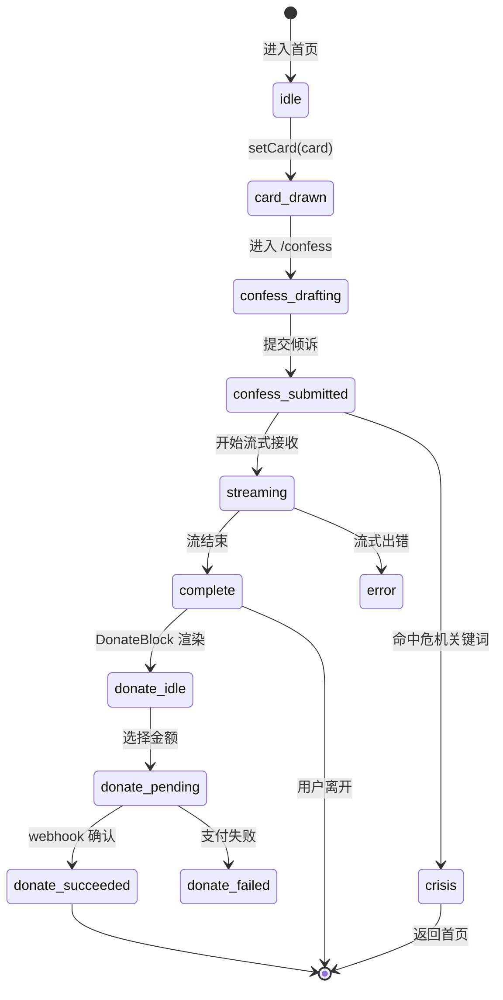

# 8. 状态管理

> 本文件是 PRD/ 文件夹的第 8 部分。如需了解产品全貌请先读 [README.md](./README.md)。
> 上一模块：[07-business-logic.md](./07-business-logic.md) · 下一模块：[09-error-handling.md](./09-error-handling.md)

---

## 8.1 全局状态结构

V1 拆 2 个 Zustand Store：`sessionStore`（业务核心数据）+ `uiStore`（UI 状态）。

### sessionStore（业务核心）

```typescript
// src/stores/sessionStore.ts
import { create } from 'zustand';
import { persist } from 'zustand/middleware';
import type { TarotCard } from '@/types/session';

interface SessionState {
  // 当前 session 的核心数据
  sessionId: string | null;       // 服务端创建后回写的 nanoid
  card: TarotCard | null;         // 当前抽到的牌
  confessDraft: string;           // 倾诉文本草稿（输入中持久化）
  readingText: string;            // 累积接收的开示文本
  readingPhase: 'idle' | 'streaming' | 'complete' | 'error' | 'crisis';
}

interface SessionActions {
  setSessionId: (id: string) => void;
  setCard: (card: TarotCard) => void;
  setConfessDraft: (text: string) => void;
  appendReadingChunk: (chunk: string) => void;
  setReadingPhase: (phase: SessionState['readingPhase']) => void;
  reset: () => void;              // 用于"再来一张牌"清空当前会话
}

export const useSessionStore = create<SessionState & SessionActions>()(
  persist(
    (set) => ({
      sessionId: null,
      card: null,
      confessDraft: '',
      readingText: '',
      readingPhase: 'idle',

      setSessionId: (id) => set({ sessionId: id }),
      setCard: (card) => set({ card }),
      setConfessDraft: (text) => set({ confessDraft: text }),
      appendReadingChunk: (chunk) =>
        set((s) => ({ readingText: s.readingText + chunk })),
      setReadingPhase: (phase) => set({ readingPhase: phase }),
      reset: () =>
        set({
          sessionId: null,
          card: null,
          confessDraft: '',
          readingText: '',
          readingPhase: 'idle',
        }),
    }),
    {
      name: 'hug-session-draft',
      // 只持久化输入中的草稿；reading 内容不持久化（隐私 + 流式重连复杂度）
      partialize: (s) => ({ confessDraft: s.confessDraft }),
    }
  )
);
```

### uiStore（UI 状态）

```typescript
// src/stores/uiStore.ts
import { create } from 'zustand';

interface UIState {
  toast: { message: string; type: 'info' | 'error' | 'success' } | null;
  isPrivacyDialogOpen: boolean;
  isLeavingGuardOpen: boolean;    // 流式生成中尝试关闭页面时的守卫
}

interface UIActions {
  showToast: (message: string, type?: 'info' | 'error' | 'success') => void;
  clearToast: () => void;
  openPrivacyDialog: () => void;
  closePrivacyDialog: () => void;
  setLeavingGuard: (open: boolean) => void;
}

export const useUIStore = create<UIState & UIActions>((set) => ({
  toast: null,
  isPrivacyDialogOpen: false,
  isLeavingGuardOpen: false,

  showToast: (message, type = 'info') => set({ toast: { message, type } }),
  clearToast: () => set({ toast: null }),
  openPrivacyDialog: () => set({ isPrivacyDialogOpen: true }),
  closePrivacyDialog: () => set({ isPrivacyDialogOpen: false }),
  setLeavingGuard: (open) => set({ isLeavingGuardOpen: open }),
}));
```

## 8.2 Store 划分

| Store 名称 | 职责 | 包含状态 |
|-----------|------|---------|
| `sessionStore` | 当前匿名会话的业务数据流转 | sessionId, card, confessDraft, readingText, readingPhase |
| `uiStore` | UI 临时状态（不持久化） | toast, dialog 开关, 路由守卫 |

> **不做**: 全局用户 store（无登录用户）、订单 store（打赏由 hook 管理本地状态 + 服务端为单一来源）、历史记录 store（V1 无历史）

## 8.3 状态流转



## 8.4 持久化策略

| 状态 | 持久化位置 | 过期 | 备注 |
|------|-----------|------|------|
| `sessionStore.confessDraft` | localStorage（zustand persist）| 浏览器清空时丢失 | 仅草稿，避免输入中刷新丢失 |
| `sessionStore` 其他字段 | **不持久化** | 内存 only | 隐私要求：开示内容不留客户端 |
| `uiStore` 全部 | 不持久化 | 内存 only | UI 临时状态 |
| Session id | 服务端 cookie（HttpOnly） | 24h | → [06-data-model.md](./06-data-model.md) §6.4 |

> 持久化的最小化是产品价值的一部分：用户每次回来看到的是"全新的一夜"，不是历史负担。

## 8.5 跨组件数据流转示例

**抽牌 → 倾诉 → 开示** 的状态流：

1. `/draw` 页 `CardDraw.onCardDrawn(card)` → `sessionStore.setCard(card)`
2. 路由跳 `/confess`，组件读 `sessionStore.card`（无则 redirect 回 `/draw`）
3. 输入触发 `sessionStore.setConfessDraft(text)`（自动持久化）
4. 提交触发 `POST /api/reading`，响应中拿到 `sessionId` → `sessionStore.setSessionId(id)`
5. 路由跳 `/reading/[sessionId]`，挂载 `StreamingReading`：
   - `sessionStore.setReadingPhase('streaming')`
   - 每个 chunk → `sessionStore.appendReadingChunk(chunk)`
   - 流结束 → `sessionStore.setReadingPhase('complete')`
6. 用户点"再来一张" → `sessionStore.reset()` + 路由跳 `/draw`

## 8.6 不做（V1）

- ❌ Redux / RTK / Jotai（Zustand 足够轻）
- ❌ 全局用户身份状态（无登录）
- ❌ 通过 URL 参数传递业务状态（除 sessionId 外）
- ❌ 跨页面 BroadcastChannel / 多标签同步
